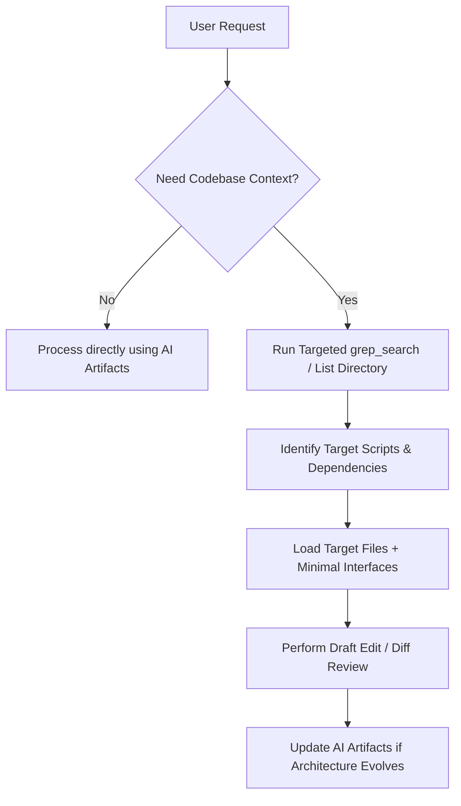
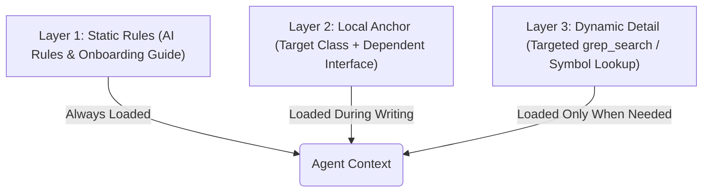

# Fit-Me 2026: Token Optimization & Coding Efficiency Guide

As a Unity project expands, loading large numbers of C# scripts, assembly files, or scenes into the AI agent's context window becomes highly inefficient, leading to high latency, increased token costs, and a higher risk of the model hallucinating, losing focus, or exceeding context limits.

This guide outlines the core techniques and strategies to optimize token usage while maintaining engineering consistency and agent efficiency.

---

## 🗺️ Token-Efficient Development Workflow

Below is the recommended workflow to minimize token ingestion during coding, debugging, and refactoring sessions:

---

## 🛠️ Key Techniques for Token Reduction

### 1. Context Isolation (Targeted Loading)
* **What it is**: Loading only the specific scripts, assemblies, or classes under active revision, rather than the entire project directories.
* **How it helps**: A single script or class is typically 100–500 lines (~1,000–5,000 tokens), whereas the full Unity codebase can easily exceed millions of tokens.
* **Rule of Thumb**: Only load the **target script** (using `view_file` with specific line ranges if the file is large) and, if necessary, the interface it implements (e.g. `IPanelViewModel.cs`) or its immediate dependency signatures.

### 2. Compressed Reference Guides (The Continuity Engine)
* **What it is**: Relying on high-density reference files—like [onboarding_doc.md](file:///mnt/ssd1/All%20projects/Unity/Fit-Me-2026/AI%20Artifacts/onboarding_doc.md) and [agent_instructions.md](file:///mnt/ssd1/All%20projects/Unity/Fit-Me-2026/AI%20Artifacts/agent_instructions.md)—to maintain codebase consistency.
* **How it helps**: These files summarize coding conventions (VContainer, R3, UniTask, MVVM) and git workflows in a few thousand tokens, removing the need for the agent to scan many scripts to "remember" design patterns.
* **Continuity Updates**: When a new module or system introduces a permanent change in convention, update these reference guides immediately so they are captured for future sessions.

### 3. Layout Indexing via Search
* **What it is**: Using high-performance search tools (`grep_search`) to locate specific types, methods, and class usage instead of reading entire directories.
* **How it helps**: Enables the agent to locate where specific systems (like the save system or sound transitions) are referenced without reading every file.

### 4. Git Diff Inspections
* **What it is**: Reviewing changes using `git diff` instead of reading the entire modified file again.
* **How it helps**: Diffs only contain the modified lines and minimal surrounding context, saving thousands of tokens during post-edit verification.

### 5. Delegating to Specialized Subagents
* **What it is**: Invoking a lightweight, read-only `research` subagent to search for specific terms or facts across the codebase while keeping the primary agent's context clean.

---

## ⚖️ Striking the Balance: The Layered Context Strategy

Relying *exclusively* on high-level guides can lead to a loss of **implementation precision, API signatures, and local styling conventions** that exist only in the code. To strike a perfect balance between token consumption and deep contextual awareness, use a **Layered Context Strategy**:

### 1. The Three Layers of Context
1. **Layer 1: Static Rules (Low Tokens - Always Loaded)**:
   * Keep files like [ai_rules.md](file:///mnt/ssd1/All%20projects/Unity/Fit-Me-2026/ai_rules.md) and [onboarding_doc.md](file:///mnt/ssd1/All%20projects/Unity/Fit-Me-2026/AI%20Artifacts/onboarding_doc.md) in the active context. This ensures that coding patterns, casing conventions, and framework rules are always present.
2. **Layer 2: Local Anchor (Medium Tokens - Active Workspace)**:
   * Load the specific target file plus the immediate interface or parent class (e.g., `PanelView` when modifying a specific view). This keeps the local implementation details and API contracts consistent.
3. **Layer 3: Dynamic Details (On-Demand - Lazy Loaded)**:
   * If a specific API or class contract is needed, do **not** load the file containing it. Instead, perform a quick search (`grep_search`) to extract only the relevant class declaration or method signature, and insert it into the context.

### 2. Separation of Planning vs. Implementation
* **Phase 1: Planning Mode (Token-Efficient)**: Focus purely on architecture and class relationships. Outline changes, create a checklist, or write a diff plan without editing or writing files.
* **Phase 2: Implementation Mode (Context-Dense)**: Perform targeted modifications on small, modular chunks (using `replace_file_content` rather than overwriting whole files).

---

## 📊 Approach Comparison

| Aspect | Naive Approach (Full Context) | Optimized Approach (Targeted + Reference) |
| :--- | :--- | :--- |
| **Token Cost per Query** | Proportional to total codebase size (High & Scaling) | Flat rate based on Target File + References (Low & Stable) |
| **Latency / Response Speed** | Slow (long prompt processing time) | Extremely fast (small context size) |
| **Architectural Consistency**| Weak (agent must extract patterns from raw code, prone to errors) | Strong (patterns are explicitly structured in reference guides) |
| **Focus / Precision** | Lower (larger context increases risk of hallucination) | Higher (agent focusing on a narrow block of code) |

---

> [!TIP]
> **Maintain your References**: As you add new features or packages, treat [onboarding_doc.md](file:///mnt/ssd1/All%20projects/Unity/Fit-Me-2026/AI%20Artifacts/onboarding_doc.md) as the single source of truth. Keeping these clean and up-to-date is the most effective way to ensure the agent never loses continuity.
